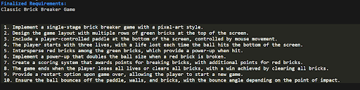

# Dev GPTeam: An end-to-end application to transform ideas into operable software

Dev GPTeam is a command-line application designed to streamline the software development process by leveraging the power of GPT models. This application allows users to input initial software requirements and uses GPT-powered interactions to refine requirements, generate source code.

## Features

- Requirement refinement through simulated PM GPT interaction.
- Source code generation with simulated Dev GPT model.
- Code validation and quality checks with simulated QA GPT model.
- Simple command-line interface for ease of use.
- Provide a checkpoint/snapshot feature so that users can restart from any stage. For example, they can regenerate source code from the latest requirements without going through PM GPT again.

## Game Generation Demo

<div>
    
    
    
</div>
<div>
    
    
    
</div>

## Getting Started

### Prerequisites

Before running Dev GPTeam, make sure you have Python 3.9 or higher installed on your system. You can download it from [python.org](https://www.python.org/downloads/).

You can also run the software inside [Anaconda](https://www.anaconda.com/download).

### Installation and Usage

1. Clone the repository to your local machine.

```
git clone https://github.com/ece1786-2023/DevGPTeam.git
```

2. Copy `.env.example` to create your `.env` file and add your `OPENAI_API_KEY`.

3. Install Dependencies

```
cd DevGPTeam
pip install -r requirements.txt
```

4. Launch the application:

```
python src/main.py
```

## Simple Demo/Example

Step 1: Display greeting message and receive sample user input.
<br/>

Step 2: PM GPT requests additional information and receives sample user response 尸.
<br/>

Step 3: PM GPT dive into the details for a more concrete requirement.
<br/>

Step 4: PM GPT creates detailed requirements and asks for user confirmation.
<br/>

Step 5: PM GPT finalizes requirements and passes them to Developer GPT.
<br/>

Step 6: Developer GPT generates and outputs the source code
<br/>

Step 7: QA GPT reviews the code, make necessary improvement, and output the final version
<br/>

Step 8: Code generation is completed, and the software is ready to run.
<br/>

## Advanced Usages

### Generate source code from a checkpoint/snapshot file

usage:

```
main.py [-h] [--skipPM] [--skipDev] [--skipQA] [--snapshot-directory SNAPSHOT_DIRECTORY]
```

example:

```
python src\main.py --skipPM --snapshot brick_breaker_game
```

### Configure GPT Agent Prompts

Find the prompt configurations for PM GPT, Developer GPT, and QA GPT in the `src/gpt_agent_config` folder.
